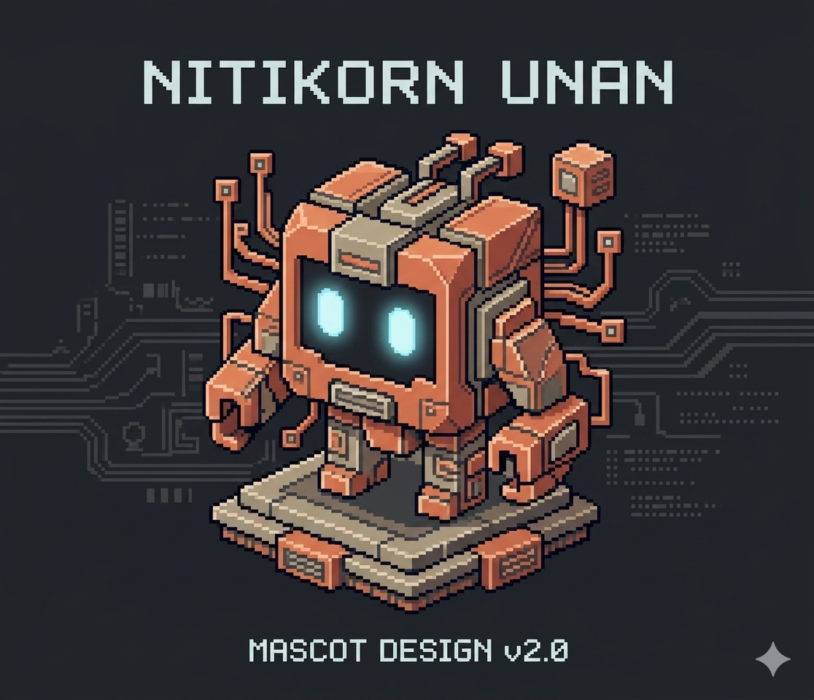

# Nitikorn Unan - Personal Contact Website

เว็บไซต์ส่วนตัวสำหรับติดต่อ Nitikorn Unan พร้อมลิงก์ไปยังช่องทางต่างๆ

## ฟีเจอร์

- ✨ **มาสคอทพิกเซลอาร์ต** - ตัวละครสไตล์ Claude พร้อมอนิเมชัน
- 📱 **รองรับมือถือ** - Responsive design สำหรับทุกขนาดหน้าจอ
- 🔗 **ลิงก์ช่องทางติดต่อ** - Facebook, Instagram, Email, LINE, TikTok, GitHub
- 📝 **ฟอร์มติดต่อ** - สำหรับส่งข้อความโดยตรง
- 🎮 **Pixel Art Style** - ดีไซน์สไตล์พิกเซลอาร์ต
- ⚡ **Interactive Effects** - เอฟเฟกต์และอนิเมชันต่างๆ

## โครงสร้างโปรเจค

```
personal-website/
├── index.html          # หน้าหลัก
├── styles.css          # สไตล์และดีไซน์
├── script.js           # JavaScript และอนิเมชัน
├── images/             # โฟลเดอร์รูปภาพ
│   └── mascot.png      # รูปมาสคอท (ต้องเพิ่ม)
└── README.md           # ไฟล์นี้
```

## วิธีใช้งาน

### 1. เพิ่มรูปมาสคอท
วางไฟล์รูปมาสคอท (mascot.png) ที่คุณอัปโหลดไว้ในโฟลเดอร์ `images/`
จากนั้นแก้ไฟล์ `index.html` บรรทัดที่ 18-23 โดยเปลี่ยนจาก CSS mascot เป็น:
```html
<div class="mascot-container">
    
</div>
```

และเพิ่ม CSS ใน `styles.css`:
```css
.mascot-image {
    width: 100%;
    height: 100%;
    object-fit: contain;
    animation: float 3s ease-in-out infinite;
    image-rendering: pixelated;
}
```

### 2. แก้ไขลิงก์
ตรวจสอบและแก้ไขลิงก์ต่างๆ ใน `index.html` ให้ถูกต้อง:
- Instagram: `https://instagram.com/think_bypluem`
- Email: `mailto:nitikornunan@gmail.com`
- LINE: `https://line.me/ti/p/~Pluem`
- TikTok: `https://tiktok.com/@nitikorn_302005`
- GitHub: `https://github.com/nitikornunan-stack`
- Project: `https://github.com/nitikornunan-stack/cj-smart-tracker`

### 3. เชื่อมต่อฟอร์มติดต่อ
ปัจจุบันฟอร์มติดต่อทำงานแบบจำลอง (simulation) หากต้องการให้ทำงานจริง คุณต้อง:
- เชื่อมต่อกับ backend service (เช่น Formspree, Netlify Forms)
- หรือสร้าง server ของตัวเอง

ตัวอย่างการใช้ Formspree:
```html
<form action="https://formspree.io/f/YOUR_FORM_ID" method="POST">
```

### 4. อัปโหลดขึ้น GitHub
```bash
git init
git add .
git commit -m "Initial commit"
git branch -M main
git remote add origin https://github.com/nitikornunan-stack/personal-website.git
git push -u origin main
```

### 5. เผยแพร่เว็บไซต์
คุณสามารถใช้บริการฟรีเช่น:
- **GitHub Pages** - เผยแพร่จาก repository
- **Netlify** - ลากและวางโฟลเดอร์
- **Vercel** - ลากและวางโฟลเดอร์

## สิ่งที่ต้องทำเพิ่มเติม

- [ ] เพิ่มรูปมาสคอทลงในโฟลเดอร์ `images/`
- [ ] แก้ไข HTML ให้ใช้รูปมาสคอทจริง
- [ ] ตรวจสอบลิงก์ทั้งหมดให้ถูกต้อง
- [ ] เชื่อมต่อฟอร์มติดต่อกับ backend service
- [ ] อัปโหลดขึ้น GitHub
- [ ] เผยแพร่เว็บไซต์

## เทคโนโลยีที่ใช้

- HTML5
- CSS3 (Grid, Flexbox, Animations)
- Vanilla JavaScript
- Google Fonts (Press Start 2P, Kanit)

## Credit

พัฒนาโดย Nitikorn Unan
มาสคอทพิกเซลอาร์ตสไตล์ Claude
